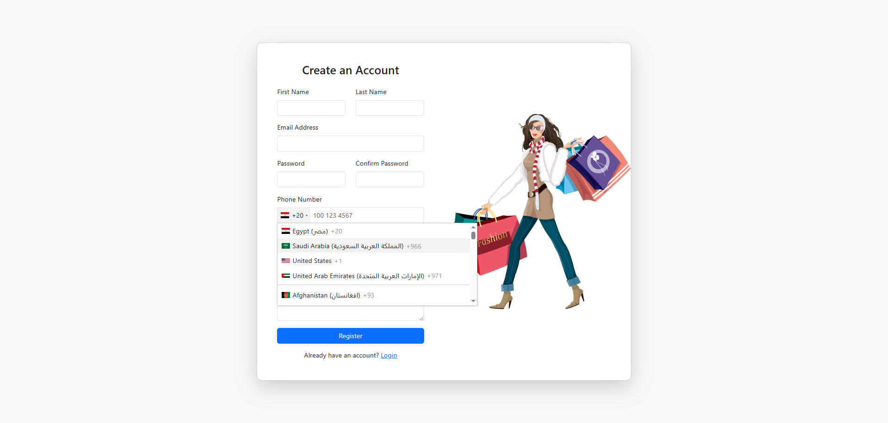
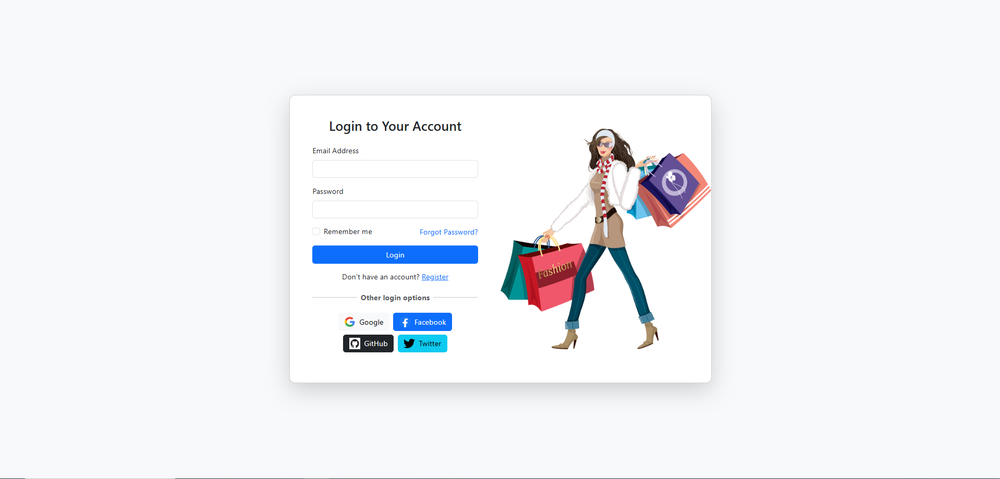
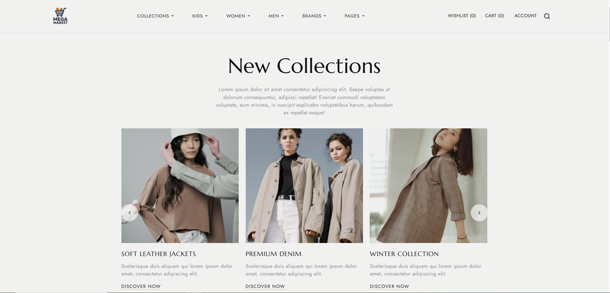
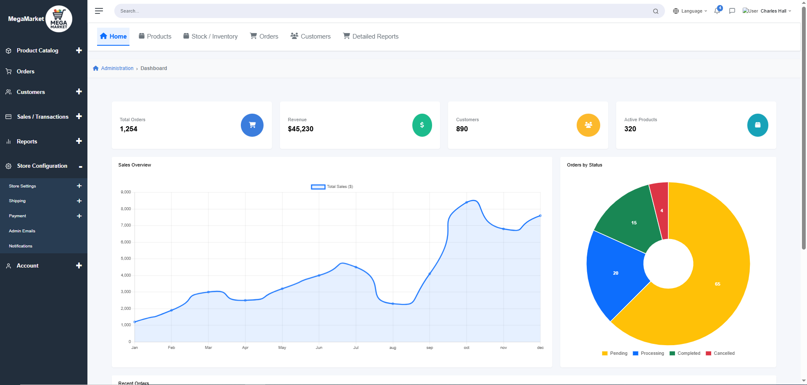

# MegaMarket — E-commerce Clothing Platform

A full-stack e-commerce application built with **Laravel** (frontend + backend) for a modern clothing store. This repository contains the application code and visual screenshots so visitors can quickly see key flows (register, login, storefront, dashboard) directly from the README.

---

## Table of contents

* [About](#about)
* [Features](#features)
* [Tech Stack](#tech-stack)
* [Screenshots](#screenshots)
* [Installation (quick)](#installation-quick)
* [Notes on Images & Optimization](#notes-on-images--optimization)
* [License](#license)
* [Contact](#contact)

---

## About

MegaMarket is an e-commerce clothing platform demonstrating a complete Laravel implementation including:

* Customer registration & authentication
* Product catalog and storefront UI
* Admin dashboard for product management
* Order flow and basic checkout UI (prototype)

This repo includes representative screenshots so contributors and reviewers can preview the UI without running the app.

---

## Features

* Authentication (register / login)
* Responsive storefront with product listing and detail pages
* Admin dashboard: add/edit products, view orders
* Image uploads for products and user avatars (demo)
* Clean, component-based Blade views

---

## Tech Stack

* **Backend & Frontend:** Laravel (Blade)
* **Database:** MySQL / MariaDB (configurable)
* **Assets:** Laravel Mix (or Vite) for compiling CSS/JS
* **Auth:** Laravel Breeze / Sanctum (depending on branch)
* **Optional:** Git LFS for large assets

---

## Screenshots

> Images are stored in `screenshots/` (relative to repo root). If you change file names, update the paths below.

### Authentication

**Register**


**Login**


### Storefront

**Home / Products**


### Admin

**Dashboard**


> Tip: Click any image to view the full-size version in the repository.

---

## Installation (quick)

1. Clone the repo:

```bash
git clone https://github.com/USERNAME/megamarket-ecommerce.git
cd megamarket-ecommerce
```

2. Copy environment and install dependencies:

```bash
cp .env.example .env
composer install
npm install
npm run build   # or `npm run dev`
php artisan key:generate
```

3. Configure database in `.env` and run migrations:

```bash
php artisan migrate --seed
```

4. Start the app:

```bash
php artisan serve
```

---

## Notes on Images & Optimization

* Store screenshots in a `screenshots/` folder at repo root for clear organization.
* Use **relative paths** in markdown so images render automatically on GitHub:

  ```md
  
  ```
* Recommended image practices:

  * Resize to a web-friendly width (e.g., 1200px max) to reduce repo size.
  * Convert to **WebP** if supported, and include a PNG fallback if needed.
  * Compress images losslessly (e.g., with `pngquant`, `cwebp`) before committing.
* If your images are large or numerous, consider using **Git LFS**:

  ```bash
  git lfs install
  git lfs track "screenshots/*"
  git add .gitattributes
  git add screenshots/
  git commit -m "Add screenshots via Git LFS"
  ```
* Keep README thumbnails modest in pixel dimensions so the page loads quickly.

---

## Contributing

Contributions welcome. Please open an issue or PR with:

* bug fixes
* UI improvements (include updated screenshots)
* README / documentation enhancements

When updating screenshots, remember to:

1. Add the new files to `screenshots/`
2. Update paths in `README.md`
3. Commit and push (use Git LFS if files are large)

---

## License

This project is released under the MIT License. See `LICENSE` for details.

---

## Contact

Mohamed Hassan — `your-email@example.com` (replace with preferred contact)

---

**Need me to**:

* update screenshots into the README with exact file names you used, or
* generate a compressed / web-ready version of each image and show sample commands?

If yes, paste your image filenames (or upload them) and I’ll update the README image links accordingly.
